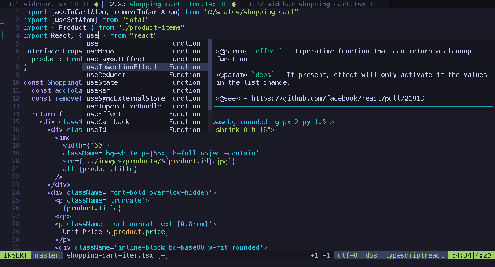

<div align="center">

# TM10YMhp's dotfiles
Mis dotfiles para `Windows` y `Linux`. Simplemente elija el fragmento de código que comprenda totalmente.

</div>

<!-- imagen -->


## 💡 ¿Encontraste un problema o tienes una sugerencia?
Si encuentra algun problema o tiene alguna sugerencia, por favor abre un issue y estare encantado de discutirlo contigo.

## ✨ Contenidos
### 🔥 Editor de Texto
Neovim >= 0.10.0: [config]

<sub>(en Windows necesitara [Visual C++ Redistributable](https://learn.microsoft.com/es-es/cpp/windows/latest-supported-vc-redist?view=msvc-170))</sub>

### 🐚 Shell
cmd - Windows
- [Clink](https://github.com/chrisant996/clink) >= 1.6.0: [config]
- [w64devkit](https://github.com/skeeto/w64devkit)

bash - Linux

## ⚡️ Requisitos previos

## 🚀 Empezando

```bash
git submodule init
git submodule update
```

```bash
git pull --recurse-submodules
```

## 🛠️ Extras
### 🗃️ Módulos globales de NPM
- pnpm
- npm-check-updates
- tree-node-cli
- npkill

### 🧶 Otros
- [neofetch](https://github.com/nepnep39/neofetch-win)
