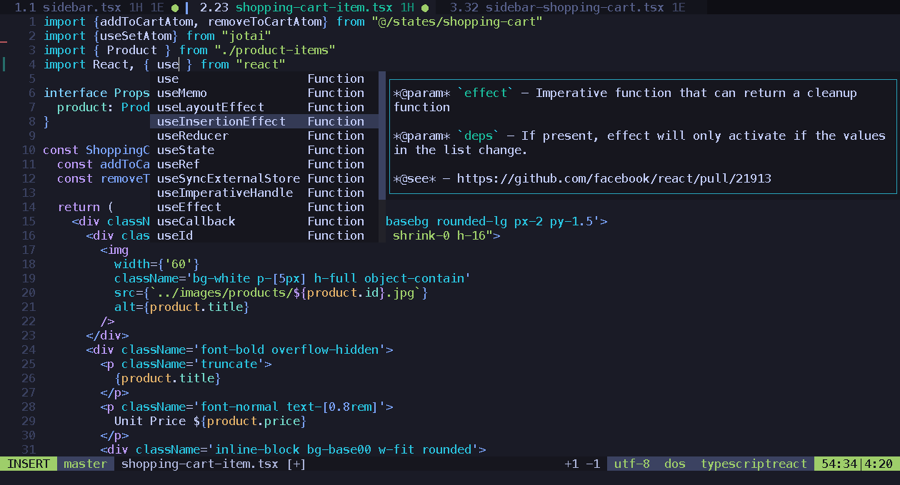

# TM10YMhp's dotfiles

**Advertencia**: No uses ciegamente mi configuración a menos que sepas lo que eso implica. ¡Úselo bajo su propio riesgo!



<details>
  <summary><sub><b>
    El tema <code>Serene</code> esta activado por defecto, puedo cambiarlo por <a href="https://github.com/folke/tokyonight.nvim">Tokyonight</a> desde <code>init.lua</code>
  </summary></sub></b>

  ```lua
  -- vim.cmd[[colorscheme serene]]
  vim.cmd[[colorscheme tokyonight]]
  ```

</details>


## Neovim setup

Requiere [neovim](https://github.com/neovim/neovim), [git](https://git-scm.com/), [npm](https://nodejs.org/en/download), [ripgrep](https://github.com/BurntSushi/ripgrep), [make](https://www.gnu.org/software/make/) y [sed](https://www.gnu.org/software/sed/).

Para usuarios de Windows, `make` y `sed` estan incluidos en [w64devkit](https://github.com/skeeto/w64devkit).

<details><summary>Plugins</summary>

- [folke/tokyonight.nvim](https://github.com/folke/tokyonight.nvim)
- [folke/lazy.nvim](https://github.com/folke/lazy.nvim)
- [nvim-lualine/lualine.nvim](https://github.com/nvim-lualine/lualine.nvim)
- [akinsho/nvim-bufferline.lua](https://github.com/akinsho/nvim-bufferline.lua)
- [neovim/nvim-lspconfig](https://github.com/neovim/nvim-lspconfig)
- [williamboman/mason.nvim](https://github.com/williamboman/mason.nvim)
- [williamboman/mason-lspconfig.nvim](https://github.com/williamboman/mason-lspconfig.nvim)
- [voldikss/vim-floaterm](https://github.com/voldikss/vim-floaterm)
- [lewis6991/gitsigns.nvim](https://github.com/lewis6991/gitsigns.nvim)
- [echasnovski/mini.completion](https://github.com/echasnovski/mini.completion)
- [echasnovski/mini.splitjoin](https://github.com/echasnovski/mini.splitjoin)
- [kylechui/nvim-surround](https://github.com/kylechui/nvim-surround)
- [nvim-pack/nvim-spectre](https://github.com/nvim-pack/nvim-spectre)
- [folke/flash.nvim](https://github.com/folke/flash.nvim)
- [junegunn/vim-easy-align](https://github.com/junegunn/vim-easy-align)
- [numToStr/Comment.nvim](https://github.com/lewis6991/gitsigns.nvim)
- [ojroques/nvim-osc52](https://github.com/ojroques/nvim-osc52)
- [nvim-telescope/telescope.nvim](https://github.com/nvim-telescope/telescope.nvim)
- [nvim-telescope/telescope-fzf-native.nvim](https://github.com/nvim-telescope/telescope-fzf-native.nvim)
- [nvim-telescope/telescope-file-browser.nvim](https://github.com/nvim-telescope/telescope-file-browser.nvim)
- [nvim-telescope/telescope-project.nvim](https://github.com/nvim-telescope/telescope-project.nvim)
- [debugloop/telescope-undo.nvim](https://github.com/debugloop/telescope-undo.nvim)
- [olacin/telescope-cc.nvim](https://github.com/olacin/telescope-cc.nvim)
- [iamcco/markdown-preview.nvim](https://github.com/iamcco/markdown-preview.nvim)

</details>

## Shell setup

  - **Windows**
    - [clink](https://github.com/chrisant996/clink) añade el autocompletado y el prompt.
    - [w64devkit](https://github.com/skeeto/w64devkit) añade comandos unix.
  - **Linux**
    - Reemplace el `PS1` para el prompt.

## NPM Global Modules

- [npm-check-updates](https://github.com/raineorshine/npm-check-updates)
