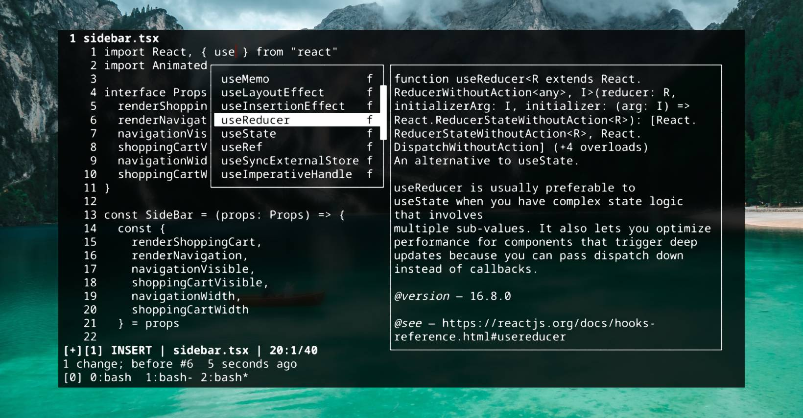

## Dotfiles

**Advertencia**: No use esta configuración a menos que sepa lo que implica.



Si su memoria RAM es limitada modifique el [tamaño máximo de memoria de node](https://nodejs.org/api/cli.html#--max-old-space-sizesize-in-megabytes).

Limitar la memoria puede llevar a comportamientos inesperados.

```bash
NODE_OPTIONS=--max-old-space-size=200
```

### Requerido

- neovim >= **0.8.0**
- git >= **2.19.0**
- node >= **18.14.0**
- npm >= **9.3.1**
- tmux >= **3.3a**

### Sugerido

- ripgrep >= **12.1.1**
- fd-find >= **8.2.1**

### Opcional

- @mryhryki/markdown-preview
- npm-check
- commitizen
